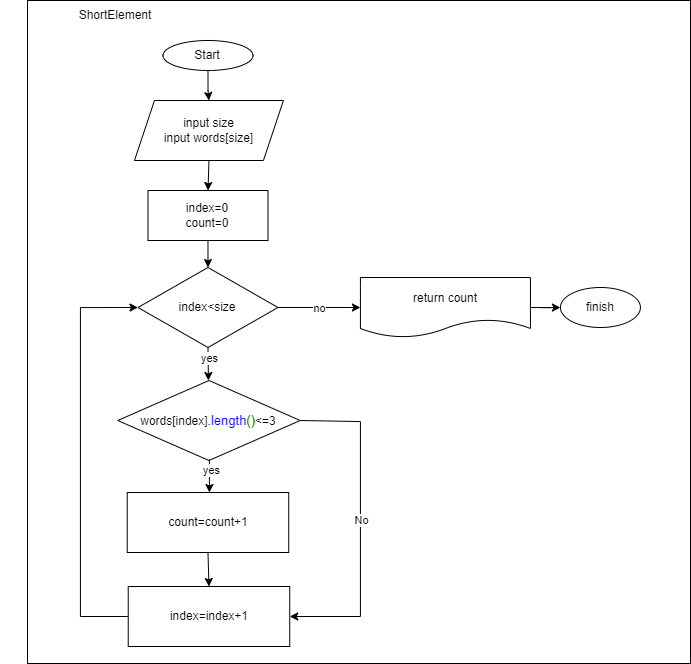
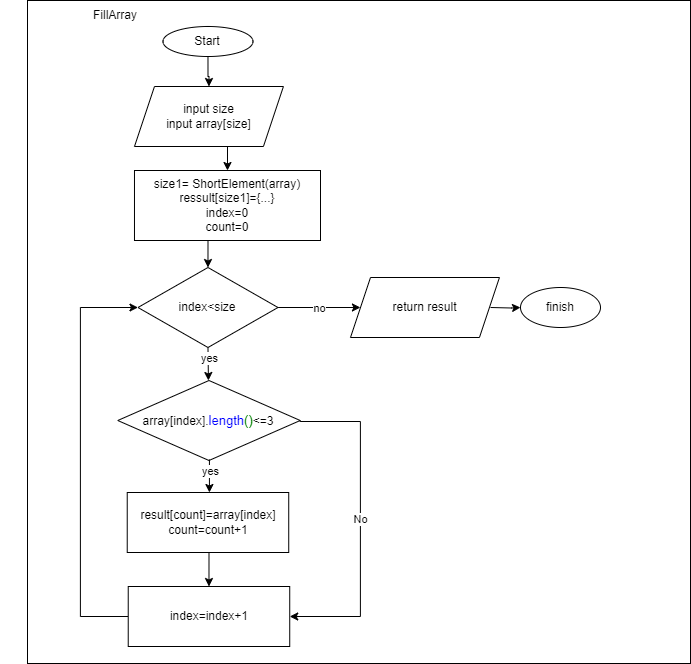

# Задача: 
Написать программу, которая из имеющегося массива строк формирует новый массив из строк, длина которых меньше, либо равна 3 символам. Первоначальный массив можно ввести с клавиатуры, либо задать на старте выполнения алгоритма. При решении не рекомендуется пользоваться коллекциями, лучше обойтись исключительно массивами.

## Примеры:
* [“Hello”, “2”, “world”, “:-)”] → [“2”, “:-)”]
* [“1234”, “1567”, “-2”, “computer science”] → [“-2”]
* [“Russia”, “Denmark”, “Kazan”] → []

# Описание решения:
1. Задаётся одномерный массив words с текстовыми элементами
2. Размер массива и элементы вводятся с клавиатуры
3. Метод PrintArray печатает элементы массива в кавычках, через пробел с запятыми
4. Метод ShortElement считает количество элементов массива, содержащих не более 3 символов:
* 
5. Метод FillArray задаёт массив result и заполняет его элементами массива words, содержащими не более 3 символов
* 
6. На печать выводится массив words и массив result, если он содержит хотя бы 1 элемент